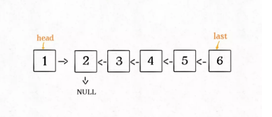
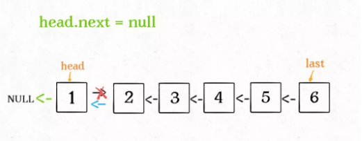

### 递归
**递归的主框架**
```
递归函数：
    递归终止条件
    递归主体
    递归处理过程
```
对于递归算法，**最重要的是明确递归函数的定义**，对于反转链表来说`reverse`函数具体的含义如下：
- 输入一个节点`head`，将(以`head`为起点)的链表反转，并返回反转之后的头结点。
在实际的理解过程中，**不要试图跳进递归中**，要根据函数的定义，来弄清楚这段代码会产生什么结果：

按照这个定义，这个`reverse(head.next)`执行完成后，整个链表应该会变成如下：

并且根据函数的定义，`reverse`函数会返回之后的头结点，这里用`last`接收。
```
head.next.next = head
```

继续接下来的操作
```
head.next = None
return last
```


**代码**
*C++ version*
```
/**
 * Definition for singly-linked list.
 * struct ListNode {
 *     int val;
 *     ListNode *next;
 *     ListNode() : val(0), next(nullptr) {}
 *     ListNode(int x) : val(x), next(nullptr) {}
 *     ListNode(int x, ListNode *next) : val(x), next(next) {}
 * };
 */
class Solution {
public:
    int cur = 0;
    ListNode* removeNthFromEnd(ListNode* head, int n) {
        if(!head) return NULL;
        head->next = removeNthFromEnd(head->next, n);
        cur++;
        if(n == cur) return head->next;
        return head;
    }
};
```

*python version*
```
# Definition for singly-linked list.
# class ListNode:
#     def __init__(self, val=0, next=None):
#         self.val = val
#         self.next = next
class Solution:
    def __init__(self):
        self.cur = 0
    def removeNthFromEnd(self, head: Optional[ListNode], n: int) -> Optional[ListNode]:
        if head is None:
            return None
        head.next = self.removeNthFromEnd(head.next, n)
        self.cur += 1
        if self.cur is n:
            return head.next
        return head
        
```


**参考**
- [python local variable to global](https://sabe.io/blog/python-local-variable-referenced-before-assignment#:~:text=In%20this%20post%2C%20we%20learned,a%20value%20before%20using%20it.)
- [Python not defined recursive function?](https://stackoverflow.com/questions/36488439/python-not-defined-recursive-function)