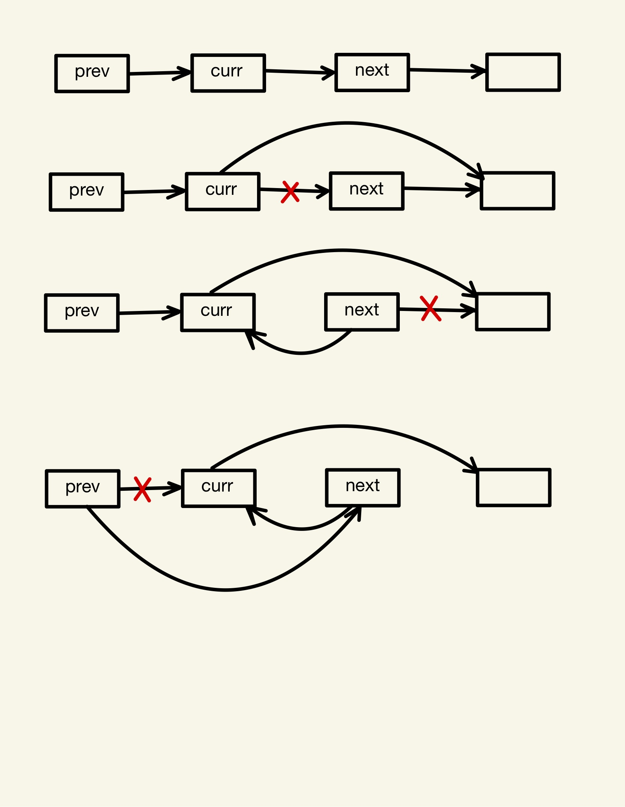

### 头插法

**代码**
*C++ version*
```
/**
 * Definition for singly-linked list.
 * struct ListNode {
 *     int val;
 *     ListNode *next;
 *     ListNode() : val(0), next(nullptr) {}
 *     ListNode(int x) : val(x), next(nullptr) {}
 *     ListNode(int x, ListNode *next) : val(x), next(next) {}
 * };
 */
class Solution {
public:
    ListNode* reverseKGroup(ListNode* head, int k) {
        ListNode* dummy = new ListNode(-1, head);
        ListNode* prev = dummy;
        while(true){
            //检查剩余节点是否有k个，不满足则返回
            ListNode* last = prev;
            for(int i = 0; i < k; i++){
                last = last->next;
                if(last == nullptr){
                    return dummy->next;
                }
            }
            //反转k个节点
            ListNode* curr = prev->next;
            ListNode* next;
            for(int i = 0; i < k - 1; i++){
                next = curr->next;
                curr->next = next->next;
                next->next = prev->next;
                prev->next = next;
            }
            prev = curr;
        }
    }
};
```
*python version*
```
# Definition for singly-linked list.
# class ListNode:
#     def __init__(self, val=0, next=None):
#         self.val = val
#         self.next = next
class Solution:
    def reverseKGroup(self, head: Optional[ListNode], k: int) -> Optional[ListNode]:
        dummy = ListNode(-1, head)
        prev = dummy
        while True:
            #检查剩余是否满足k个节点
            last = prev
            for i in range(k):
                last = last.next
                if last is None:
                    return dummy.next
            #反转k个节点
            curr = prev.next
            for i in range(k - 1):
                next = curr.next
                curr.next = next.next
                next.next = prev.next
                prev.next = next
            prev = curr
```